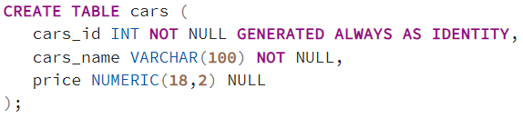
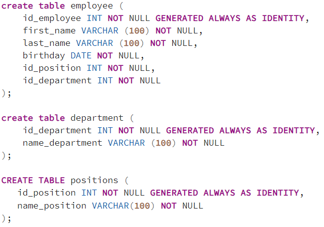
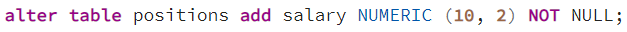
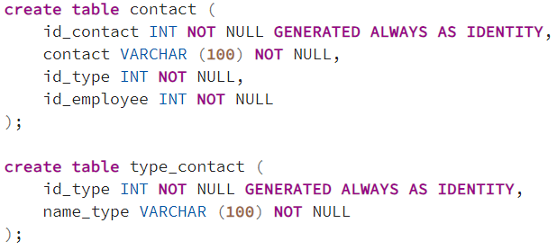

## Задача 1
Создайте таблицу, которая будет хранить информацию об автомобилях, назовите ее cars.

Она должна содержать следующие столбцы:

- Идентификатор автомобиля, столбец должен автоматически генерировать значения (обязательный для заполнения столбец);
- Наименование марки автомобиля (обязательный для заполнения столбец);
- Стоимость автомобиля (столбец заполнять необязательно).

### Решение

## Задача 2
Опирайтесь на данные из предыдущей задачи.

В процессе эксплуатации системы у Вас возникла необходимость добавить столбец с описанием автомобиля в таблицу cars.

Напишите инструкцию, которая добавит новый столбец в таблицу cars (назовите его car_description).

В данном столбце будет храниться произвольный текст не более 100 символов, при этом у некоторых автомобилей описания может и не быть.

### Решение

## Задача 3
Опирайтесь на данные из предыдущих задач.

В процессе дальнейшей эксплуатации системы выяснялось, что 100 символов для описания автомобиля недостаточно.

Напишите инструкцию, которая увеличит размер поля для хранения описания автомобиля до 1000 символов.

### Решение

## Задача 4
Опирайтесь на данные из предыдущих задач.

В связи с изменением требований предметной области и информационной системы, возникла необходимость хранить стоимость автомобиля в отдельной таблице.

Для этого Вы создали отдельную таблицу, однако в таблице cars, которая хранит информацию об автомобилях, образовались избыточные данные в виде столбца с ценой.

Поэтому у Вас встала задача удалить столбец с ценой автомобиля из таблицы cars.

Напишите инструкцию удаления данного столбца.

### Решение

## Задача 5
Опирайтесь на данные из предыдущих задач.

Информационная система полностью модернизирована, в связи с этим необходимость в таблице cars отпала.

Напишите инструкцию удаления таблицы cars.

### Решение

## Задача 6
Вы участвуете в проекте по разработке информационной системы предприятия.

Вам поставили задачу разработать и создать таблицы для хранения информации о сотрудниках.

В базе данных обязательно должна быть сохранена следующая информация о сотрудниках:

- ФИО – Фамилия Имя Отчество сотрудника;
- Дата рождения – дата рождения сотрудника;
- Должность – занимаемая должность сотрудника в этой организации;
- Подразделение – отдел, в котором работает сотрудник;
В требованиях предметной области указано, что сотрудник числится только в одном подразделении, в каждом подразделении работает много сотрудников, при этом согласно штатному расписанию в разных подразделениях могут работать сотрудники с одинаковым названием должности.

Какие таблицы, и с какой структурой, Вы создадите для хранения данной информации?

Напишите инструкции создания таблиц.

### Решение

## Задача 7
Опирайтесь на данные из предыдущей задачи.

В процессе эксплуатации информационной системы предприятия у Вас возникла необходимость хранить еще и оклад сотрудника в соответствии с занимаемой должностью.

Какое изменение Вы внесете в структуру таблиц?

Напишите соответствующую SQL инструкцию.

### Решение

## Задача 8
Опирайтесь на данные из задач 6 и 7.

В процессе дальнейшей эксплуатации информационной системы возникла необходимость хранить личные контактные данные сотрудников. При этом у сотрудника может быть несколько источников для связи с ним, например, Email, несколько телефонных номеров и так далее.

Какое изменение в структуру базы данных Вы внесёте?

Напишите соответствующие SQL инструкции.

### Решение

