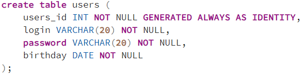
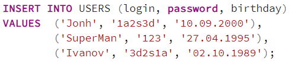
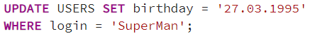
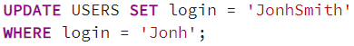
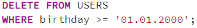
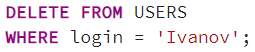
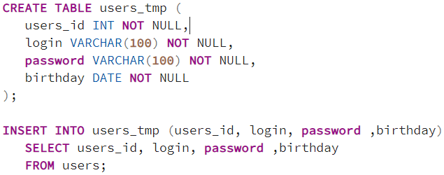
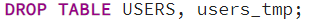

## Задача 1
Вы участвуете в проекте по разработке и сопровождению сайта.

Вам поставили задачу создать таблицу для хранения учетных данных пользователей.

В таблице необходимо хранить:

- Имя пользователя (логин)
- Пароль
- Дату рождения
Напишите инструкцию создания таблицы для хранения соответствующих данных.

### Решение

## Задача 2
После создания таблицы Вам дали список пользователей, которых необходимо добавить в систему.

Напишите инструкцию добавления пользователей в таблицу, чтобы в результате после выполнения инструкции в таблице оказались следующие данные.

| user_name |	password |	birthday   |
|-----------|----------|-------------| 
| Jonh      |	1a2s3d   |	10.09.2000 |
| SuperMan  |	123      |	27.04.1995 |
| Ivanov    |	3d2s1a   |	02.10.1989 |

### Решение

## Задача 3
После добавления пользователей выяснилось, что пользователь «SuperMan» неверно указал дату своего рождения.

Напишите инструкцию изменения даты рождения у пользователя «SuperMan». Правильная дата его рождения – 27.03.1995

### Решение

## Задача 4
В процессе эксплуатации системы пользователь «Jonh» захотел изменить свой логин, вместо «Jonh» он пожелал быть «JohnSmith».

Напишите инструкцию, которая изменит имя пользователя Jonh на JohnSmith.

### Решение

## Задача 5
Руководство дало Вам задание удалить из системы всех пользователей, которые не достигли определённого возраста, допустим, всех, кто родился позже «01.01.2000».

Напишите инструкцию, которая удалит всех пользователей, подходящих под данное условие.

### Решение

## Задача 6
В связи с модернизацией сайта возникла необходимость присвоить всем пользователям стандартный пароль «Password».

Напишите инструкцию, которая изменит пароль у всех пользователей.

### Решение

## Задача 7
В процессе эксплуатации системы возникла необходимость удалить данные пользователя «Ivanov».

Напишите инструкцию, которая удалит пользователя «Ivanov».

### Решение

## Задача 8
Для разработки и тестирования нового функционала у Вас возникла необходимость создать копию таблицы с данными пользователей.

Для этого Вам нужно создать дополнительную таблицу и скопировать в нее все данные, хранящиеся в основной таблице пользователей.

Напишите соответствующие инструкции.

### Решение

## Задача 9
В процессе разработки и тестирования нового функционала возникла необходимость полностью очистить дополнительную таблицу с данными пользователей, которую мы создавали в рамках предыдущей задачи, чтобы иметь возможность заполнить ее актуальными данными, которые находятся в основной таблице.

Напишите инструкцию, которая удалит всех пользователей и позволит начать все заново.

### Решение

## Задача 10
Был разработан новый функционал, который использует другие таблицы для хранения данных пользователей.

Вам поставили задачу удалить как основную таблицу с данными пользователей, так и дополнительную.

Напишите соответствующую инструкцию.

### Решение

