## Описание схемы данных

Вы работаете в магазине, который продает компьютеры, комплектующие и другую компьютерную технику.

Для учета реализации товаров в магазине используется приложение, которое хранит данные в реляционной базе данных.

Приложение позволяет хранить информацию о товарах, покупателях и заказах. Для этого в базе данных были созданы следующие таблицы:

- buyers – таблица покупателей;
- orders – таблица заказов;
- products – таблица товаров;
- product_types – таблица типов товаров;
- orders_products – таблица связи заказов и товаров.

### ER-диаграмма

## Задача 1
У Вас возникла необходимость сформировать список цифровых товаров с их стоимостью.

Напишите запрос, который покажет наименование и стоимость всех цифровых товаров.

### Решение
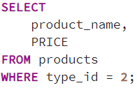

## Задача 2
Руководство захотело узнать имена всех покупателей, которые родились позже «01.01.2000».

Напишите запрос, который покажет имена и дату рождения соответствующих покупателей.

### Решение
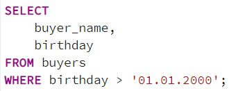

## Задача 3
Вам необходимо сформировать список товаров, у которых не заполнено описание.

Напишите запрос, который сформирует данный список. Результирующий набор должен включать столбец с наименованием и описанием товара.

### Решение
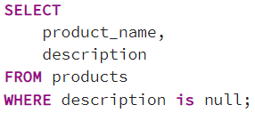

## Задача 4
У Вас возникла необходимость выгрузить все данные заказов с идентификаторами: 1708, 1959 и 2146.

Напишите запрос, который покажет все данные этих трех заказов.

### Решение
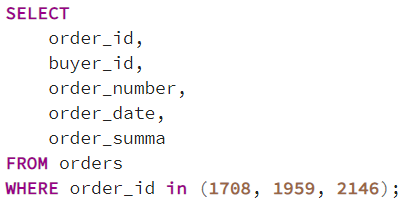

## Задача 5
У Вас возникла необходимость определить товары, которые тем или иным образом связаны с процессором.

Напишите запрос, который покажет наименование и стоимость соответствующих товаров.

### Решение
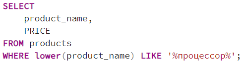

## Задача 6
У Вас возникла необходимость сформировать список всех заказов с июня по июль 2020 года.

Напишите запрос, который покажет номер и дату всех соответствующих заказов.

### Решение
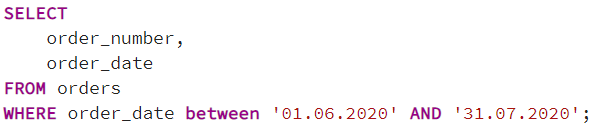

## Задача 7
У Вас возникла необходимость определить физические товары, стоимость которых более 5000 рублей.

Напишите запрос, который покажет наименовании и цену таких товаров.

### Решение
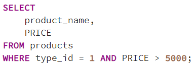

## Задача 8
У Вас возникла необходимость выгрузить данные заказов, сделанных «30.07.2020», а также заказы с номерами 151 и 298.

Напишите запрос, который покажет номер, дату и сумму соответствующих заказов.

### Решение
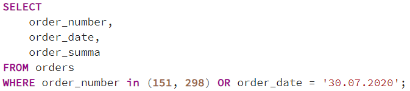

## Задача 9
Руководство поставило Вам задачу сформировать список заказов, сделанных за Май 2020, при этом в список не должны попасть заказы с номерами 400 и 410.

Напишите запрос, который сформирует данный список, в этом списке должна быть информация о номере заказа, дате и его сумме.

### Решение
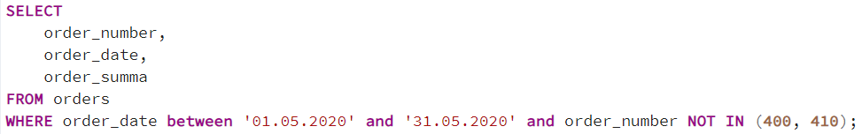

## Задача 10
У Вас возникла необходимость сформировать список физических товаров, стоимость которых превышает 1000 рублей, при этом данный список должен быть отсортирован по уменьшению цены.

Напишите запрос, который сформирует данный список, в этом списке должна быть информация о наименовании и стоимости товара.

### Решение
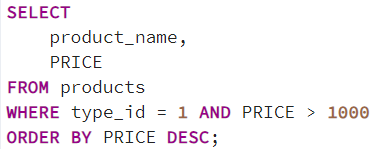

## Задача 11
Руководство поставило Вам задачу сформировать список 5 самых дорогих товаров.

Напишите запрос, который сформирует данный список, в этом списке должна быть информация о наименовании и стоимости товара.

### Решение
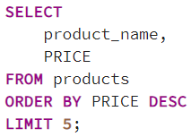

## Задача 12
Вам необходимо определить минимальную, максимальную и среднюю сумму заказа за период с Мая по Июнь 2020.

Напишите запрос, который сформирует соответствующую информацию.

### Решение
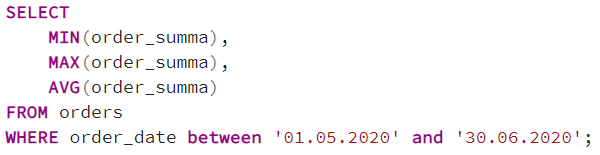

## Задача 13
Вам необходимо выгрузить список товаров, при этом в данный список должна включаться ценовая категория, к которой можно отнести товар.

Ценовая категория, используемая в данном магазине:

- Менее 1000
- От 1000 до 5000 (включительно)
- Свыше 5000

Напишите запрос, который сформирует список товаров, включающий наименование, стоимость и ценовую категорию товара.

### Решение
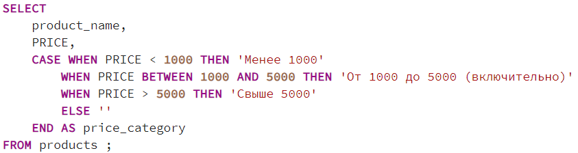

## Задача 14
Вам поставили задачу определить, в какие дни было сделано больше одного заказа.

Напишите запрос, который сформирует список дней, включающий дату и количество сделанных в эту дату заказов.

### Решение
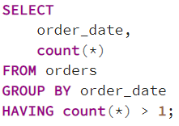

## Задача 15
Для тестирования нового функционала у Вас возникла необходимость создать копию данных, которые хранятся в таблице products. При этом идентификаторы товаров Вам не нужны.

Напишите инструкцию создания таблицы products_tmp, в которой должна храниться вся информация о товарах за исключением идентификаторов.

### Решение
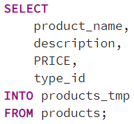
