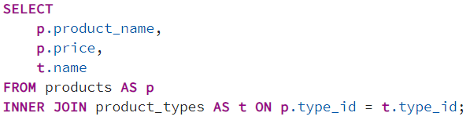
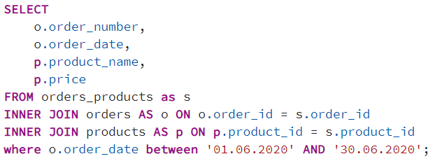
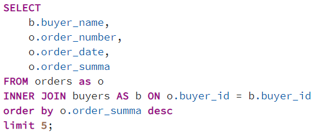
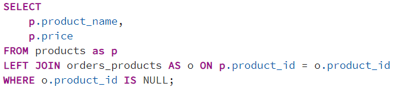
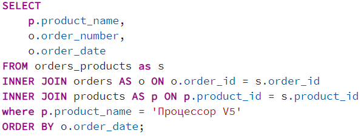
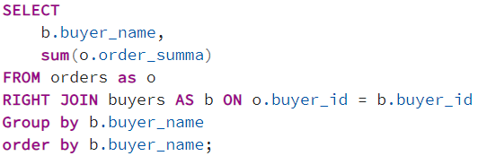
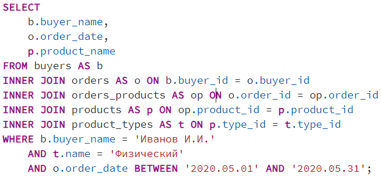
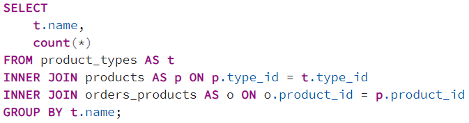
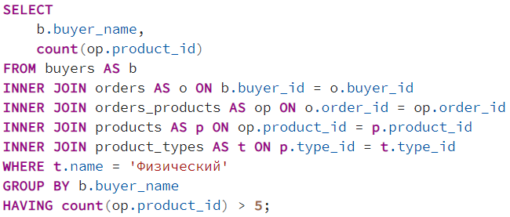

## Описание схемы данных

Вы работаете в магазине, который продает компьютеры, комплектующие и другую компьютерную технику.

Для учета реализации товаров в магазине используется приложение, которое хранит данные в реляционной базе данных.

Приложение позволяет хранить информацию о товарах, покупателях и заказах. Для этого в базе данных были созданы следующие таблицы:

- buyers – таблица покупателей;
- orders – таблица заказов;
- products – таблица товаров;
- product_types – таблица типов товаров;
- orders_products – таблица связи заказов и товаров.

### ER-диаграмма

## Задача 1
У Вас возникла необходимость вывести список товаров с указанием наименования типа товара.

Напишите запрос, который выведет наименование товара, его цену, а также наименование типа товара.

### Решение

## Задача 2
Руководство поставило Вам задачу составить список заказов за Июнь 2020, включая детализацию по товарам.

Напишите запрос, который выведет номер и дату заказа, наименование товаров, которые включаются в тот или иной заказ, а также цену товаров.

### Решение

## Задача 3
Вам поставили задачу сформировать список из 5 самых крупных по сумме заказов с указанием имени покупателей, сделавших данные заказы.

Напишите запрос, который покажет имя покупателя, номер, дату и сумму самых крупных по сумме заказов.

### Решение

## Задача 4
Вам поставили задачу определить товары, которые не пользуются спросом, в частности товары, которые еще никто не покупал.

Напишите запрос, который выведет наименование таких товаров и их цену.

### Решение

## Задача 5
У Вас возникла необходимость определить все заказы, в которых участвует товар с наименованием «Процессор V5».

Напишите запрос, который выведет наименование товара, номер и дату заказов с данным товаром. Данные отсортируйте по дате заказа.

### Решение

## Задача 6
Вас попросили узнать, на какую сумму каждый из покупателей сделал заказы в Вашем магазине, т.е. сколько всего денег потратил каждый из покупателей.

Напишите запрос, который выведет имя покупателя и общую сумму денег, которую он потратил, при этом отсортируйте список по имени покупателя.

### Решение

## Задача 7
Вам поставили задачу определить, какие физические товары покупал «Иванов И.И.» в Мае 2020.

Напишите запрос, который выведет имя покупателя, дату покупки и наименование товаров, которые он покупал.

### Решение

## Задача 8
У Вас возникла необходимость подсчитать, сколько всего товаров было продано с разбивкой по типу товара, т.е. сколько было продано физических товаров и сколько было продано цифровых товаров.

Напишите запрос, который выведет наименование типа товара и количество продаж.

### Решение

## Задача 9
Вам необходимо определить покупателей, которые купили больше 5 физических товаров.

Напишите запрос, который выведет имя покупателя и количество купленных им физических товаров, при этом в выборку должны попасть только покупатели, купившие более 5 физических товаров, покупатели купившие 5 или менее физических товаров нас не интересуют.

### Решение

