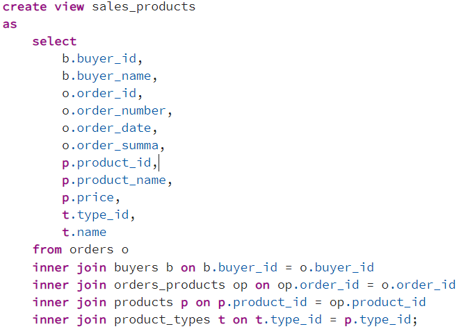
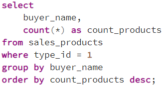
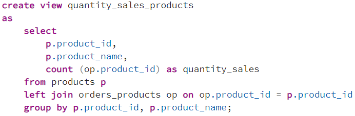
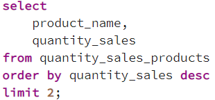
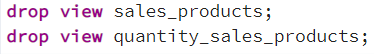

## Описание схемы данных

Вы работаете в магазине, который продает компьютеры, комплектующие и другую компьютерную технику.

Для учета реализации товаров в магазине используется приложение, которое хранит данные в реляционной базе данных.

Приложение позволяет хранить информацию о товарах, покупателях и заказах. Для этого в базе данных были созданы следующие таблицы:

- buyers – таблица покупателей;
- orders – таблица заказов;
- products – таблица товаров;
- product_types – таблица типов товаров;
- orders_products – таблица связи заказов и товаров.

### ER-диаграмма

## Задача 1
Вам постоянно требуется знать всю информацию о заказах и товарах, которые приобретают покупатели в Вашем магазине.

Для удобства Вы решили создать представление sales_products, которое будет возвращать детализированные данные о продажах.

Данные должны включать:

- Идентификатор и имя покупателя
- Идентификатор, номер, дата и сумма заказа
- Идентификатор, наименование и стоимость товара
- Идентификатор и наименование типа товара

Напишите инструкцию создания соответствующего представления.

### Решение

## Задача 2
Напишите запрос, который покажет, сколько физических товаров приобрел каждый из покупателей за все время, при этом в качестве источника используйте созданное ранее представление.

Результирующий набор должен включать имя покупателя и количество приобретенных физических товаров, при этом отсортируйте полученный результат по уменьшению количества покупок.

### Решение

## Задача 3
Вам постоянно требуется знать, сколько единиц каждого товара было продано за все время, поэтому Вы решили создать представление quantity_sales_products для удобства.

Представление должно возвращать:

- Идентификатор товара
- Наименование товара
- Количество продаж

Напишите инструкцию создания соответствующего представления.

### Решение

## Задача 4
Напишите запрос, который покажет 2 самых продаваемых товара, при этом используйте в качестве источника созданное ранее представление.

Выборка должна включать наименование товара и количество продаж.

### Решение

## Задача 5
У Вас возникла необходимость удалить все представления.

Напишите инструкции удаления созданных ранее представлений.

### Решение

