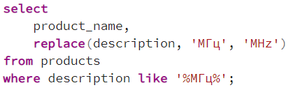
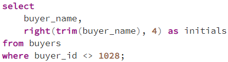
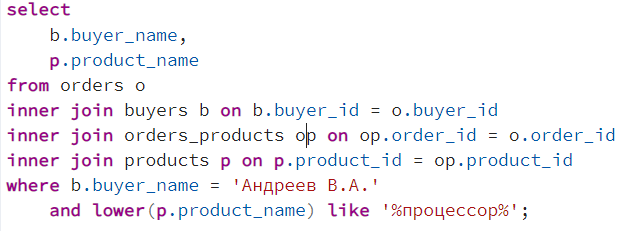
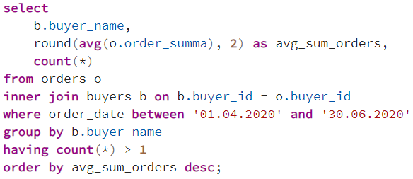
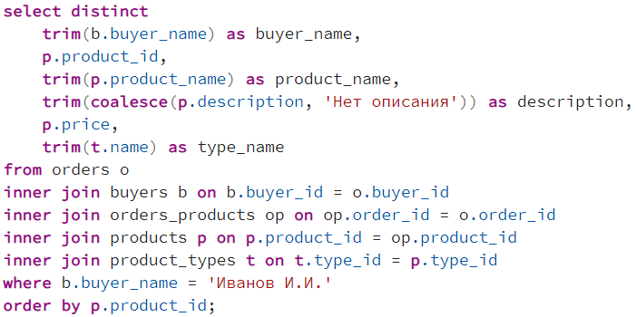

## Описание схемы данных

Вы работаете в магазине, который продает компьютеры, комплектующие и другую компьютерную технику.

Для учета реализации товаров в магазине используется приложение, которое хранит данные в реляционной базе данных.

Приложение позволяет хранить информацию о товарах, покупателях и заказах. Для этого в базе данных были созданы следующие таблицы:

- buyers – таблица покупателей;
- orders – таблица заказов;
- products – таблица товаров;
- product_types – таблица типов товаров;
- orders_products – таблица связи заказов и товаров.

### ER-диаграмма

## Задача 1
У Вас возникла необходимость определить товары, в описании которых присутствует слово «МГц», однако при выводе данных Вам необходимо заменить данное слово на «MHz».

Выборка должна включать наименование товара и его описание с уже заменённым словом.

Напишите соответствующий запрос.

### Решение

## Задача 2
У Вас возникла необходимость вывести инициалы покупателей в отдельном столбце.

Выборка должна включать столбец с полным именем и столбец, содержащий только инициалы, при этом исключите из выборки покупателя с идентификатором 1028.

Напишите соответствующий запрос.

### Решение

## Задача 3
Вам поставили задачу определить, какие товары, связанные с процессором, приобретал покупатель «Андреев В.А.».

Напишите универсальный запрос, который будет выводить такие товары, приобретенные данным покупателем.

Выборка должна включать имя покупателя и наименование товара.

### Решение

## Задача 4
У Вас возникла необходимость определить среднюю стоимость заказа для каждого покупателя за период с Апреля по Июнь 2020, при этом в выборку должны попасть покупатели, сделавшие более одного заказа, а также итоговую среднюю стоимость необходимо округлить до 2-х знаков после запятой.

Выборка должна включать имя покупателя, среднюю стоимость заказа и количество заказов. Итоговый результат отсортируйте по уменьшению средней стоимости заказа.

Напишите соответствующий запрос.

### Решение

## Задача 5
У Вас возникла необходимость получить детальную информацию о товарах (включая описание и наименование типа товара), которые приобретал покупатель «Иванов И.И.», при этом если описание товара не заполнено, необходимо выводить фразу «Нет описания». Кроме этого предусмотрите, чтобы все текстовые поля выводились без пробелов в начале и в конце.

В выборке каждый товар должен быть в единственном экземпляре. Строки отсортируйте по идентификатору товара.

Напишите соответствующий запрос.

### Решение

