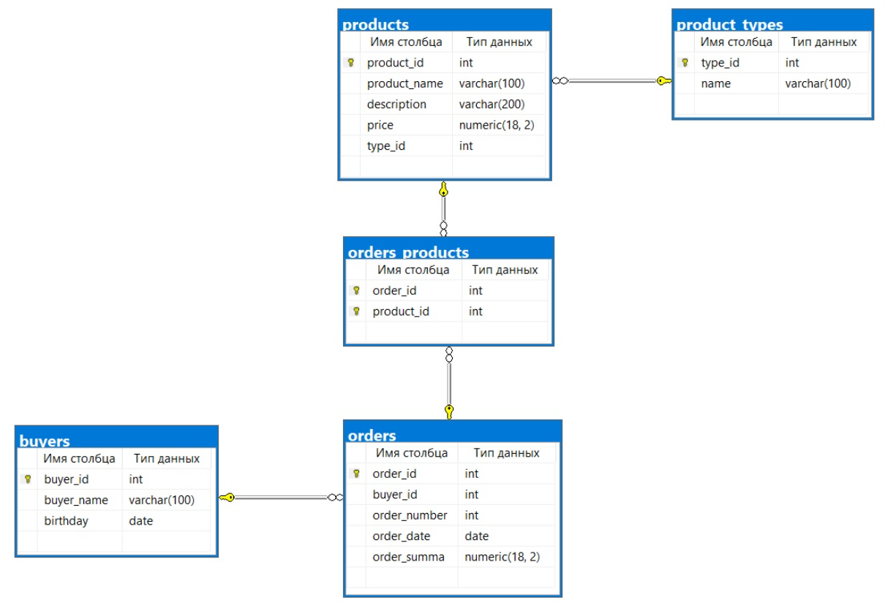
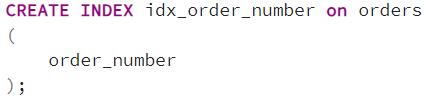
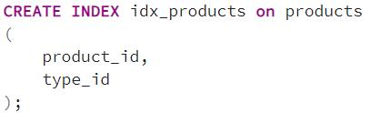
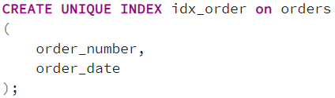
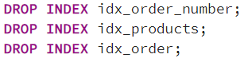

## Описание схемы данных

Вы работаете в магазине, который продает компьютеры, комплектующие и другую компьютерную технику.

Для учета реализации товаров в магазине используется приложение, которое хранит данные в реляционной базе данных.

Приложение позволяет хранить информацию о товарах, покупателях и заказах. Для этого в базе данных были созданы следующие таблицы:

- buyers – таблица покупателей;
- orders – таблица заказов;
- products – таблица товаров;
- product_types – таблица типов товаров;
- orders_products – таблица связи заказов и товаров.

### ER-диаграмма

## Задача 1
Вы достаточно часто обращаетесь к таблице с заказами (orders) по номеру заказа и поэтому решили проиндексировать данный столбец.

Напишите инструкцию создания индекса для столбца order_number таблицы с заказами.

### Решение

## Задача 2
Вы достаточно часто обращаетесь к таблице с товарами (products), при этом в качестве условий соединений с другими таблицами Вы постоянно используете идентификатор товара и тип товара.

У Вас возникла необходимость проиндексировать данные столбцы.

Напишите инструкцию создания соответствующего индекса для таблицы с товарами.

### Решение

## Задача 3
В требованиях предметной области произошли изменения, теперь номер заказа не должен повторяться в рамках одного дня.

Вы решили создать уникальный индекс, так как достаточно часто обращаетесь к таблице с заказами по номеру и дате заказа.

Напишите инструкцию, которая создаст соответствующий уникальный индекс для таблицы с заказами.

### Решение

## Задача 4
В процессе эксплуатации системы выяснялось, что все созданные ранее индексы оказались неэффективными и Вам необходимо их удалить.

Напишите инструкции для удаления всех 3 индексов, которые были созданы в предыдущих задачах 1, 2 и 3.

### Решение

