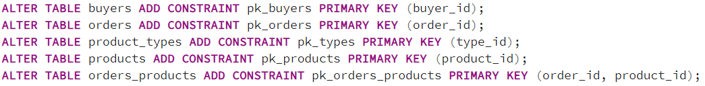
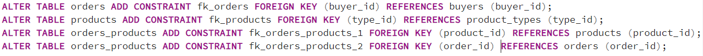
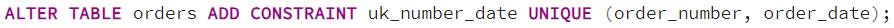
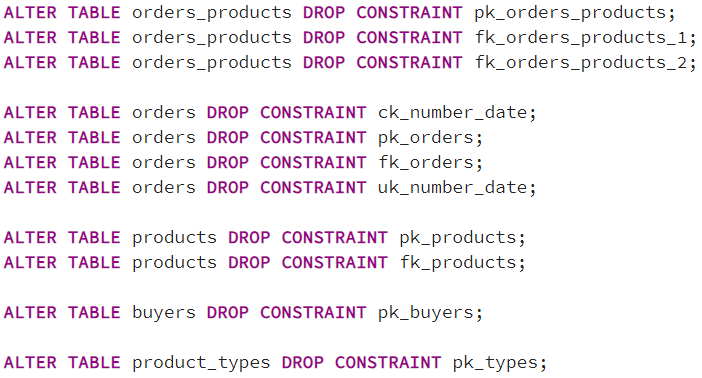
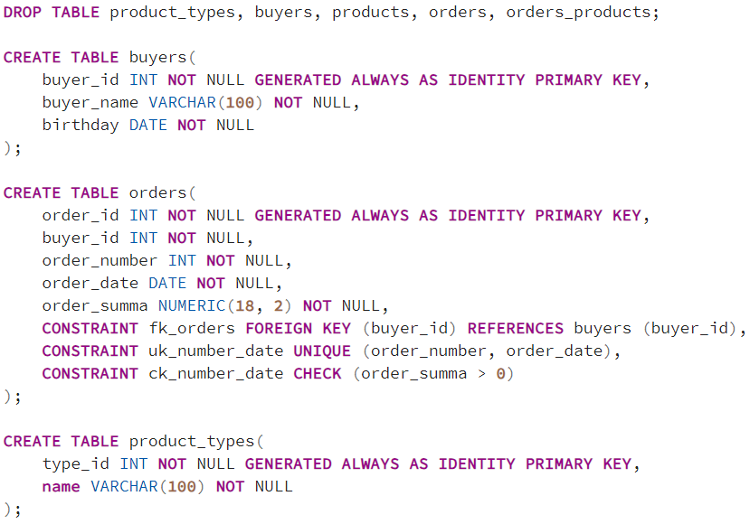
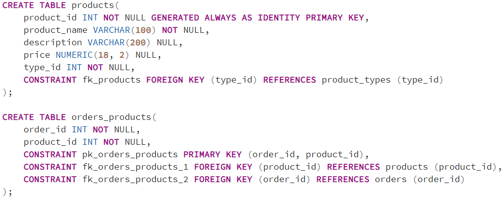

## Описание схемы данных

Вы работаете в магазине, который продает компьютеры, комплектующие и другую компьютерную технику.

Для учета реализации товаров в магазине используется приложение, которое хранит данные в реляционной базе данных.

Приложение позволяет хранить информацию о товарах, покупателях и заказах. Для этого в базе данных были созданы следующие таблицы:

- buyers – таблица покупателей;
- orders – таблица заказов;
- products – таблица товаров;
- product_types – таблица типов товаров;
- orders_products – таблица связи заказов и товаров.

### ER-диаграмма

## Задача 1
До текущего момента мы пользовались схемой данных, в таблицах которой отсутствовали ограничения первичного ключа.

Однако так быть не должно, поэтому Вам необходимо добавить в каждую таблицу ограничение первичного ключа.

Напишите инструкцию добавления первичного ключа для каждой таблицы.

### Решение

## Задача 2
В нашей схеме данных между сущностями существует определенная связь (вспоминаем занятие «Типы связей»).

Физически связь между таблицами, как Вы помните, реализуется с помощью внешних ключей.

Однако в наших таблицах физически связь никак не реализована, т.е. у нас нет никаких внешних ключей. Мы писали запросы, опираясь только на визуальное, логическое представление данных.

Реальная эксплуатация такой схемы данных будет вызывать огромное количество аномалий в процессе добавления, изменения и удаления данных в таблицах.

Чтобы исправить ситуацию, мы должны физически отразить связь между таблицами в базе данных. Это делается с помощью ограничений внешнего ключа.

Напишите инструкции добавления ограничений внешнего ключа в существующие таблицы, чтобы физически реализовать связь, которая будет соответствовать уже знакомой ER-диаграмме.

### Решение

## Задача 3
Руководство магазина снова приняло решение ввести ограничение, в соответствии с которым номер заказа не должен повторяться в рамках рабочего дня.

Вам поставили задачу реализовать данное ограничение на уровне базы данных.

Напишите инструкцию добавления соответствующего ограничения в таблицу с заказами (orders).

### Решение

## Задача 4
Согласно требованиям нашего магазина сумма заказа не должна быть равной 0 или быть отрицательной.

Поэтому Вам поставили задачу реализовать такое ограничение на уровне базы данных.

Напишите инструкцию добавления соответствующего ограничения в таблицу с заказами (orders).

### Решение

## Задача 5
В процессе эксплуатации системы у Вас возникла необходимость временно удалить все ограничения из базы данных.

Напишите инструкции для удаления всех ограничений, которые Вы создали ранее при решении предыдущих задач.

### Решение

## Задача 6
Удалите все таблицы, которые относятся к схеме нашего магазина.

У Вас имеется следующая инструкция создания таблиц в базе данных.

Она уже Вам знакома, она создает таблицы для нашего магазина, только в данном случае отсутствуют инструкции добавления данных.

#### Инструкция создания таблиц
Вам необходимо доработать данный скрипт таким образом, чтобы инструкции создания таблиц включали еще и инструкции создания всех ограничений, которые мы добавляли к таблицам при решении предыдущих задач. Иными словами, инструкции создания ограничений должны быть частью инструкций создания таблиц, т.е. должны создаваться на уровне таблицы или столбца (не отдельной инструкцией, как мы это делали ранее при решении предыдущих задач).

Таким образом, Вам необходимо написать инструкции создания таблиц, которые будут включать инструкции создания ограничений.

Вспомним условия:

- В каждой таблице должен быть первичный ключ;
- Между таблицами должна быть физически реализована связь с помощью внешних ключей;
- Номер заказа не должен повторяться в рамках рабочего дня;
- Сумма заказа не должна быть равной 0 или быть отрицательной;
- Дополнительно сделайте так, чтобы значения в столбце идентификаторов каждой таблицы автоматически увеличивались при добавлении новых записей.

В результате у Вас должен получиться скрипт, который полностью физически реализует схему данных, отражённую на уже знакомой Вам ER-диаграмме.

### Решение

