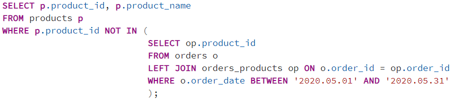
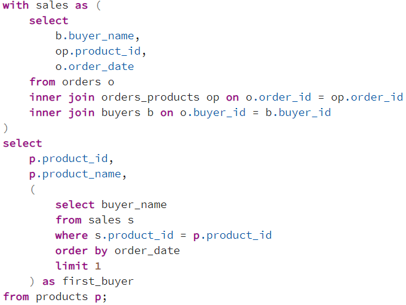

## Описание схемы данных

Вы работаете в магазине, который продает компьютеры, комплектующие и другую компьютерную технику.

Для учета реализации товаров в магазине используется приложение, которое хранит данные в реляционной базе данных.

Приложение позволяет хранить информацию о товарах, покупателях и заказах. Для этого в базе данных были созданы следующие таблицы:

- buyers – таблица покупателей;
- orders – таблица заказов;
- products – таблица товаров;
- product_types – таблица типов товаров;
- orders_products – таблица связи заказов и товаров.

### ER-диаграмма

## Задача 1
Вам поставили задачу сформировать список товаров, которые ни разу не были проданы в Мае 2020.

Напишите запрос, который выведет идентификатор и наименование таких товаров.

### Решение

## Задача 2
У Вас возникла необходимость сформировать список товаров, включая имя первого покупателя товара.

Напишите запрос, который выведет идентификатор товара, наименование товара, а также имя первого покупателя данного товара.

### Решение

