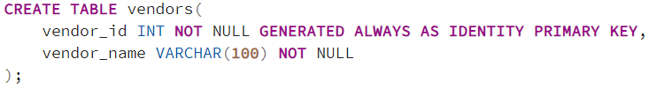
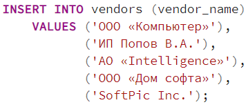
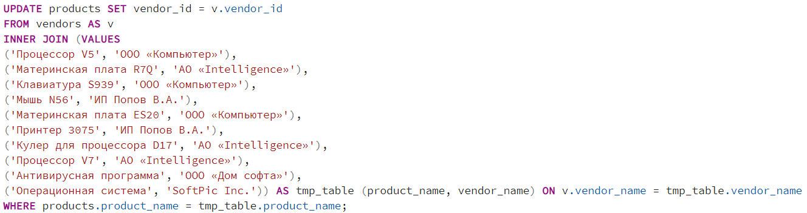
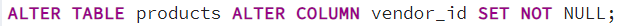
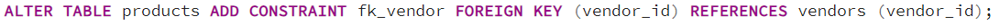
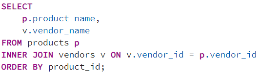
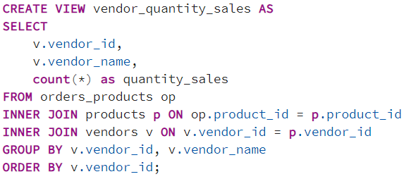
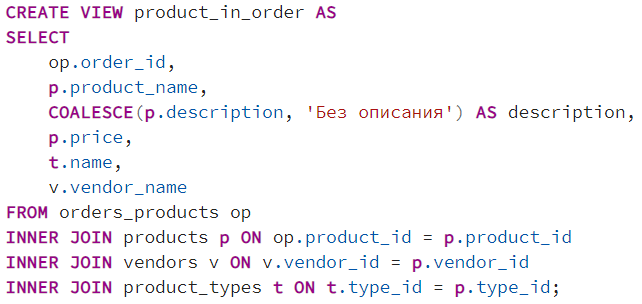
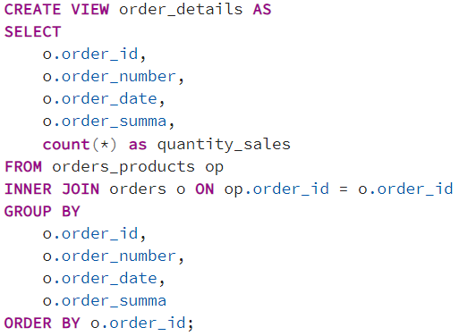
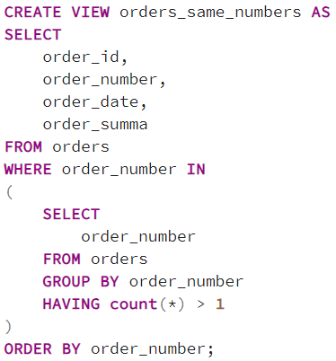

## Описание схемы данных

Вы работаете в магазине, который продает компьютеры, комплектующие и другую компьютерную технику.

Для учета реализации товаров в магазине используется приложение, которое хранит данные в реляционной базе данных.

Приложение позволяет хранить информацию о товарах, покупателях и заказах. Для этого в базе данных были созданы следующие таблицы:

- buyers – таблица покупателей;
- orders – таблица заказов;
- products – таблица товаров;
- product_types – таблица типов товаров;
- orders_products – таблица связи заказов и товаров.

### ER-диаграмма

## Часть 1. Доработка структуры базы данных
## Задача 1
В процессе эксплуатации информационной системы возникла необходимость хранить информацию о поставщиках товара.

В связи с этим Вам необходимо внести изменения в схему данных базы данных, в частности требуется создать таблицу для хранения поставщиков.

Таблицу назовите vendors, она должна хранить информацию о наименовании поставщика, при этом у нее должен быть целочисленный первичный ключ с автоинкрементом.

Поставщиков без наименования быть не может, поэтому, чтобы обезопасить себя от такой аномалии, задайте соответствующее свойство при создании таблицы.

Напишите инструкцию создания таблицы vendors.

### Решение

## Задача 2
Добавьте в таблицу vendors следующих поставщиков:

| Поставщик товара  |
|-------------------|
| ООО «Компьютер»   |
| ИП Попов В.А.     |
| АО «Intelligence» |
| ООО «Дом софта»   |
| SoftPic Inc.      |

Напишите инструкцию добавления соответствующих записей.

### Решение

## Задача 3
У каждого товара может быть только один поставщик. Чтобы реализовать связь, необходимо в таблицу с товарами добавить один столбец, который будет ссылаться на поставщика данного товара.

Добавьте в таблицу с товарами столбец для хранения идентификатора поставщика.

Напишите соответствующую инструкцию.

### Решение

## Задача 4
Чтобы актуализировать текущие данные, необходимо заполнить информацию о поставщиках по существующим товарам.

Проставьте ссылку на поставщика для каждого товара в соответствии со следующей информацией.

| Наименование товара	      | Поставщик товара  |
|---------------------------|-------------------|
| Процессор V5	            | ООО «Компьютер»   |
| Материнская плата R7Q	    | АО «Intelligence» |
| Клавиатура S939	          | ООО «Компьютер»   |
| Мышь N56	                | ИП Попов В.А.     |
| Материнская плата ES20	  | ООО «Компьютер»   |
| Принтер 3075	            | ИП Попов В.А.     |
| Кулер для процессора D17	| АО «Intelligence» |
| Процессор V7	            | АО «Intelligence» |
| Антивирусная программа	  | ООО «Дом софта»   |
| Операционная система	    | SoftPic Inc.      |

Напишите инструкции для обновления таблицы с товарами.

### Решение

## Задача 5
У товара обязательно должна быть заполнена информация о поставщике, товаров без поставщика быть не может, поэтому добавьте соответствующее ограничение в таблицу с товарами.

Напишите соответствующую инструкцию.

### Решение

## Задача 6
Чтобы физически реализовать связь между таблицей с товарами и таблицей с поставщиками, добавьте ограничение внешнего ключа в таблицу с товарами.

Напишите соответствующую инструкцию.

### Решение

## Задача 7
Напишите проверочный запрос, который покажет наименование товара и наименование соответствующего поставщика. Отсортируйте данные по идентификатору товара.

Если Вы получаете данные в соответствии с ожидаемым результатом, значит, изменения в данные Вы внесли корректно.

### Решение

## Часть 2. Реализация дополнительного функционала
## Задача 8
Разработайте представление, которое будет показывать количество проданных товаров каждого поставщика. Представление назовите vendor_quantity_sales.

Представление должно возвращать следующие данные:

- Идентификатор поставщика
- Наименование поставщика
- Количество проданных товаров

### Решение

## Задача 9
Разработайте представление, которое будет показывать детализацию заказа в части включенных в заказ товаров. Представление назовите product_in_order.

Представление должно возвращать следующие данные:

- Идентификатор заказа
- Наименовании товара
- Описание товара
- Стоимость товара
- Тип товара
- Поставщик товара

### Решение

## Задача 10
Разработайте представление, которое будет показывать детали заказа, включая количество товаров, входящих в заказ. Представление назовите order_details.

Представление должно возвращать следующие данные:

- Идентификатор заказа
- Номер заказа
- Дата заказа
- Сумма заказа
- Количество товаров

### Решение

## Задача 11
Разработайте представление, которое будет выявлять одинаковые номера заказов и выводить детализированные данные таких заказов. Представление назовите orders_same_numbers.

Представление должно возвращать следующие данные:

- Идентификатор заказа
- Номер заказа
- Дата заказа
- Сумма заказа

### Решение

